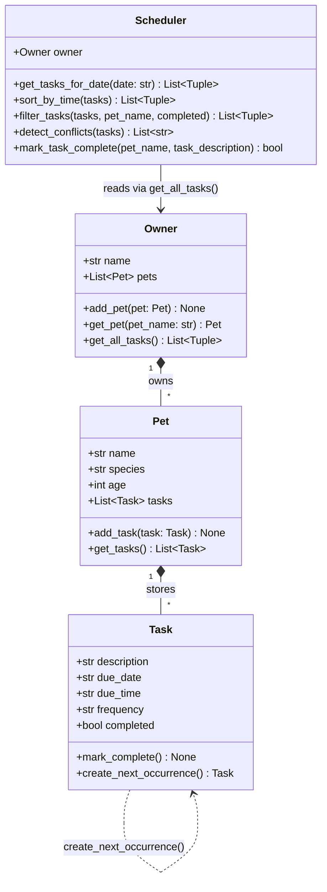

## Changes from uml_draft.md

| Element | Draft | Final |
|---|---|---|
| `Task` attributes | `title`, `duration_minutes`, `priority`, `preferred_time` | `description`, `due_date`, `due_time`, `frequency` |
| `Task` methods | `mark_complete()` only | Added `create_next_occurrence()` |
| `Pet` attributes | had `preferences: dict` | Removed; added `age: int` |
| `Pet` methods | had `remove_task()` | Removed (not needed) |
| `Owner` methods | had `remove_pet()` | Removed; added `get_all_tasks()` |
| `Scheduler` methods | `build_schedule`, `sort_tasks`, `filter_tasks(criteria: dict)`, `explain_schedule` | `get_tasks_for_date`, `sort_by_time`, `filter_tasks(pet_name, completed)`, `detect_conflicts`, `mark_task_complete` |
| Relationship type | `-->` (association) | `*--` (composition) for Owner→Pet and Pet→Task; `-->` for Scheduler→Owner |
